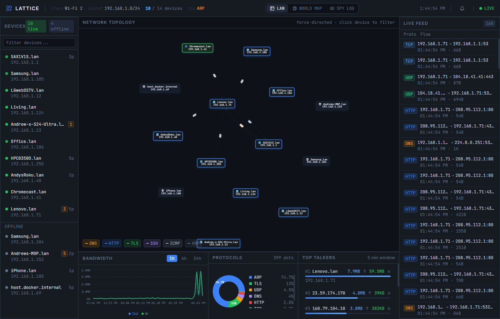
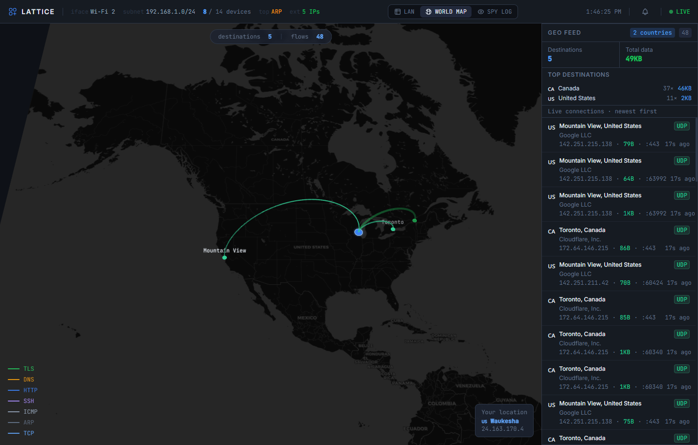
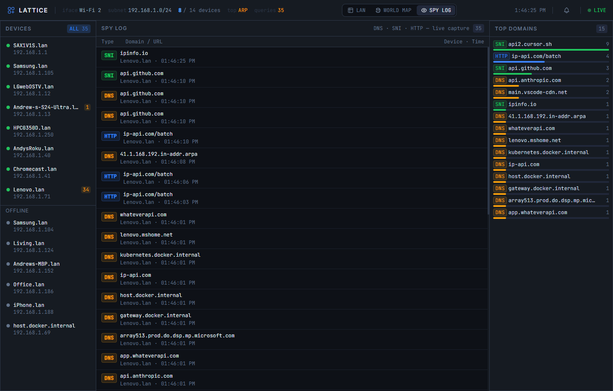

# Lattice — Local Network Intelligence Dashboard

# YOLO

A real-time, self-hosted network monitoring dashboard with a Palantir-style dark UI. Visualizes live device topology, traffic flows, DNS/SNI/HTTP intercepts, geographic connection maps, and network alerts for your local network.

---

## Screenshots

### LAN — Network Topology

Force-directed device graph, live connection feed, bandwidth timeline, protocol breakdown, and top talkers.

### World Map — Geographic Flows

deck.gl arc map showing live outbound connections geo-located by country, city, and ISP.

### Spy Log — DNS / SNI / HTTP Intercept

Per-device live capture of every DNS query, TLS SNI handshake, and plaintext HTTP request.

---

## What It Shows

### LAN View
- **Topology Graph** — force-directed map of every device on your LAN with animated traffic edges
- **Live Connection Feed** — streaming packet capture (src/dst IP, protocol, port, bytes)
- **Bandwidth Timeline** — per-device and aggregate traffic over 1h / 6h / 24h windows
- **Top Talkers** — ranked devices by outbound traffic volume in a 5-minute rolling window
- **Protocol Distribution** — donut chart of DNS, HTTP, TLS, ARP, ICMP, UDP, etc.
- **Device Panel** — MAC address, vendor, hostname, open ports, OS guess, first/last seen

### World Map View
- **Geographic Arc Map** — deck.gl WebGL globe with protocol-colored arcs to external IPs
- **Geo Feed** — sidebar listing destination countries, cities, ISPs, and byte counts
- **Live Connections** — newest-first list of external flows with protocol badges and data sizes
- **Your Location** — pin showing your public IP's geo coordinates

### Spy Log View
- **DNS Intercept** — every DNS query captured from every device, with timestamps and query types
- **SNI Intercept** — TLS Server Name Indication extracted from HTTPS handshakes (no decryption)
- **HTTP Intercept** — plaintext HTTP Host headers captured in real time
- **Top Domains** — ranked bar chart of most-queried domains, filterable per device
- **Device Selector** — click any device to filter the feed; query counts shown per device

### Alerts System
- **New Device** — warns when an unrecognized MAC joins the network
- **Device Online** — info event when a previously-offline device returns
- **Suspicious Domain** — danger alert when a device queries known malware C2, mining pools, or stalkerware domains
- **Traffic Spike** — warning when a device exceeds 15 MB/min
- Alert badge in the header shows unread count; alerts throttle at 5-minute intervals to suppress duplicates

---

## Prerequisites

### System Requirements
- Windows 10/11 (64-bit)
- Python 3.12+
- Node.js 20+

### Required System Installs

1. **Nmap** — [https://nmap.org/download.html](https://nmap.org/download.html)
   - During install, check **"Add Nmap to PATH"**
   - Used for port scanning and OS fingerprinting

2. **Npcap** — [https://npcap.com/](https://npcap.com/)
   - During install, check **"Install Npcap in WinPcap API-compatible Mode"**
   - Required for raw packet capture (replaces deprecated WinPcap)

3. **Wireshark** (optional but recommended) — [https://www.wireshark.org/download.html](https://www.wireshark.org/download.html)
   - Provides `tshark` for deep protocol dissection
   - If not installed, pyshark features are skipped gracefully

---

## Setup

### Backend

```powershell
# Must run as Administrator for packet capture and SYN scanning
cd backend
pip install -r requirements.txt
```

Edit `config.py` if you want to pin a specific network interface or subnet. By default the backend auto-detects your primary interface and subnet.

### Frontend

```powershell
cd frontend
npm install
```

---

## Running

### Start the Backend (as Administrator)

```powershell
# Open PowerShell as Administrator
cd backend
python main.py
```

Backend runs at `http://localhost:8000`. API docs at `http://localhost:8000/docs`.

### Start the Frontend

```powershell
cd frontend
npm run dev
```

Dashboard runs at `http://localhost:5173`.

---

## Configuration (`backend/config.py`)

| Setting | Default | Description |
|---|---|---|
| `INTERFACE` | `None` (auto-detect) | Network interface name for packet capture |
| `SUBNET` | `None` (auto-detect) | Subnet to scan, e.g. `192.168.1.0/24` |
| `ARP_SWEEP_INTERVAL` | `30` | Seconds between ARP sweeps for device discovery |
| `NMAP_SCAN_INTERVAL` | `300` | Seconds between full nmap port/OS scans |
| `WS_PUSH_INTERVAL` | `2` | Seconds between WebSocket pushes to frontend |
| `MAX_CONNECTIONS_HISTORY` | `500` | Max connection events kept in memory |
| `DB_PATH` | `lattice.duckdb` | Path to DuckDB database file |

---

## Architecture

```
Browser (localhost:5173)
    │
    ├── WebSocket /ws  ──────────────────────────────────────────────┐
    └── REST /api/...  ─────────────────────────────────────────┐   │
                                                                 │   │
                        FastAPI Backend (localhost:8000)         │   │
                        ┌─────────────────────────────┐         │   │
                        │  Scan Engine (scapy + nmap)  │         │   │
                        │  Capture Engine (scapy)      │─► DuckDB│   │
                        │  GeoIP Engine (ip-api.com)   │         │   │
                        │  Alert Engine                │         │   │
                        │  Enrichment (OUI + rDNS)     │         │   │
                        │  REST API ──────────────────────────────┘   │
                        │  WS Broadcaster ───────────────────────────┘
                        └─────────────────────────────┘
```

---

## API Reference

| Endpoint | Description |
|---|---|
| `GET /api/devices` | All discovered devices with metadata |
| `GET /api/traffic` | Bandwidth time-series data |
| `GET /api/dns/log` | Historical DNS/SNI/HTTP queries |
| `GET /api/dns/top` | Top queried domains with counts |
| `GET /api/dns/live` | Recent entries from in-memory ring buffer |
| `GET /api/dns/counts` | Per-device DNS query counts |
| `GET /api/events` | Historical network events/alerts |
| `GET /api/events/live` | Recent events from in-memory buffer |
| `WS  /ws` | Real-time push of all state |

---

## Database

DuckDB is used as an embedded database — no separate server process required. The `lattice.duckdb` file is created automatically on first run in the `backend/` directory.

**Tables:**
- `devices` — discovered devices with metadata
- `connections` — packet-level connection events
- `traffic_stats` — 1-minute aggregated bandwidth per device
- `dns_log` — DNS queries, TLS SNI, and HTTP host intercepts
- `geo_cache` — resolved IP-to-location records (lat/lon, city, country, ISP)
- `events` — network alert events with severity and timestamp

---

## Permissions Note

The backend **must run as Administrator** on Windows for:
- Raw packet capture (Npcap/scapy)
- SYN port scanning (nmap `-sS`)
- OS fingerprinting (nmap `-O`)

Without admin rights, it falls back to ICMP ping discovery and TCP connect scanning (slower, less accurate).

---

## Development

```powershell
# Backend with auto-reload
cd backend
uvicorn main:app --reload --host 0.0.0.0 --port 8000

# Frontend with HMR
cd frontend
npm run dev
```

---

## Dependencies

### Backend
- `fastapi` + `uvicorn` — async web framework and ASGI server
- `scapy` — packet crafting, ARP sweeps, DNS/SNI/HTTP capture
- `python-libnmap` — nmap port/OS scanning
- `duckdb` — embedded columnar database
- `httpx` — async HTTP client for GeoIP batch lookups
- `psutil` — system network interface enumeration
- `websockets` — WebSocket support

### Frontend
- `react` + `vite` + `typescript`
- `@deck.gl/react` + `@deck.gl/layers` — WebGL world map with arc/scatter layers
- `vis-network` — force-directed topology graph
- `recharts` — time-series and statistical charts
- `zustand` — lightweight state management
- `tailwindcss` — utility-first dark theme styling
